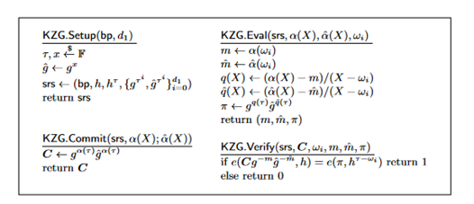

This is an implementation of KZG Commitments based on this wonderful blog:

https://alinush.github.io/2020/05/06/kzg-polynomial-commitments.html#evaluation-proofs

This is an implementation for handling two polynomials as define in Bingo paper 

