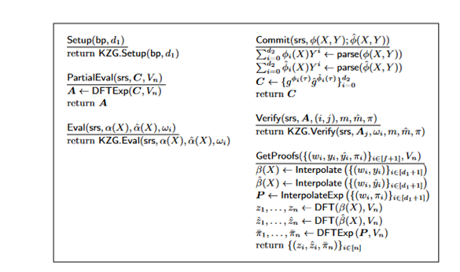

This is an implementation of KZG Commitmentsthat handles bivariate polynomials. 

This implements the scheme presented by Abraham et al. https://eprint.iacr.org/2022/1759.

For the friendly pairing curve this implementation utilised the bn256 by drand/kyber.

Implements all the functions correctly with just some modifications


Things require fixing: 

- The getProogs and PartialEvaluation eventually get the values of the exponents of the coefficients as a proof of concept implementation this is being given and exacly being calculated. 

## Example of test in tests ##

- Step 0: Initialization
Set the Suite:
Initialize the cryptographic pairing suite using the bn256 library.

```go
pairing := bn256.NewSuite()

- Step 1: Define Polynomial Degrees
The degrees d_1 and d_2 represent the maximum powers of X and Y in a bivariate polynomial.
d_1 := 4 // Degree in X
d_2 := 2 // Degree in 

Here, we define two degrees d1​ and d2​. We then create two bivariate polynomials f1​ and f2​. Each polynomial is represented as a 2D array of scalars, where f_1[i][j] represents the coefficient of the term x^iy^j.

- Step 2: Trusted Setup for Bilinear Pairings

The line trap, err := NewKzgSetup(d_1+1, pairing) creates a trusted setup for the Kate commitment scheme (KZG). This setup generates certain parameters that are used for polynomial commitments and verifications.

- Step 3: Committing the Polynomials

Using the trusted setup parameters, the polynomials f_1 and f_2 are committed using the Commits function.

- Step 4: Evaluating the Polynomial at a Specific Point

A specific point a is chosen to evaluate the polynomial. In this case, a is set to 2.

- Step 6: Creating an Evaluation Proof

Given the point a, a proof is created that the polynomial evaluates to a certain value at a. This is done using the KZGEvaluationProof function.

- Step 7: Verifying the Proof

The proof is then verified using the KZGVerify function. This function checks if the provided proof is valid for the given polynomial commitment and evaluation point.